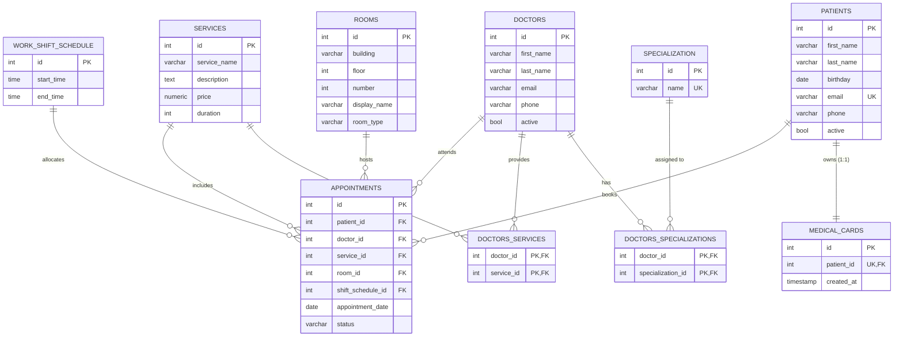

# Practical assignment 4

The task was completed by myself only, with only AI use being the python script to insert 500.000 rows. The thematic is hospital system.

## Requirements

### Basic requirements (_for 20 points_):

1) Build your own operational database for your business - done, created a hospital system.
2) Use relationships: 1:1, 1:many, many:many - many doctors to many specs, many doctors to many services, one medical card to one patient.
3) Use constraints - age cannot be < 0, price cannot be 00.00.
4) Use indexes for optimization (_that is why you need to insert approximately 500 000 rows in some tables to be able to show performance optimization_). Use `EXPLAIN ANALYZE` to compare query performance before and after creating indexes - created indexes that block certain conditions (like doctor having two appointments at the same time for two different persons) and optimization indexes for many columns, like doctor's last_name, patient's number, date for appointments.
5) Be able to present ERD.
6) Be able to explain your solution using the correct terminology.

### Additional points (_for 3 points_):
- Create at least 3 different users for different purposes **_+0.5_** - created an admin, receptionist, doctor with different permissions.

- Create at least 1 view **_+0.5_** - upcoming_appointments, appointment_date >= current date.

### ERD

### Files description

1) create_tables_script.sql - script for tables creation.
2) create_view.sql - script for view creation.
3) create_user.sql - script for adding user and for granting some privileges.
4) create_trigger.sql - script for trigger for medical card.
5) main.py - python script that inserts some data into tables.
