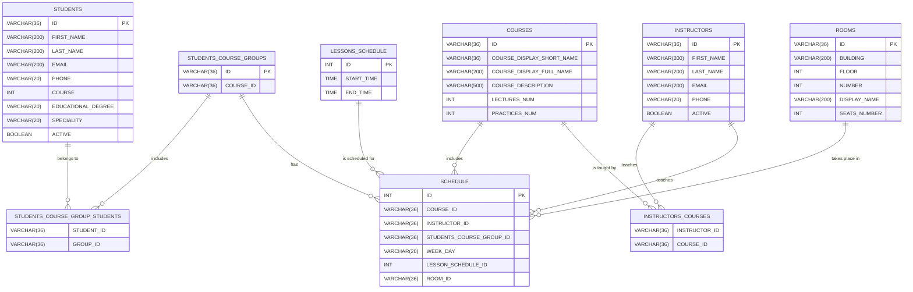

# Practical assignment 4

## The purpose of this task

Learn how to design and implement an operational PostgreSQL database for a particular application.

You can work alone or in pairs with a colleague (maximum 2 people in a team). In the case when you are working on the task together, then you should also present in pairs.

## Requirements

### Basic requirements (_for 20 points_):

1) Build your own operational database for your business.
2) Use relationships: 1:1, 1:many, many:many.
3) Use constraints.
4) Use indexes for optimization (_that is why you need to insert approximately 500 000 rows in some tables to be able to show performance optimization_). Use `EXPLAIN ANALYZE` to compare query performance before and after creating indexes.
5) Be able to present ERD.
6) Be able to explain your solution using the correct terminology.


### Additional points (_for 3 points_):
- Create at least 3 different users for different purposes **_+0.5_**

- Create at least 1 view **_+0.5_**

- Create at least 1 stored procedure **_+1_**

- Create at least 1 trigger or function **_+1_**

Meeting the basic requirements of Practical Assignment 4 allows for a maximum of 20 points to be earned, and completing additional tasks listed under the heading "Additional points" can yield up to 3 extra points.


## Additional info
I suggest you look at my example of the execution of a part of the task, which is described below (Schedule Demo).


- primary keys and foreign keys;
- constraints;
- indexes;
- views;
- users and privileges;
- stored procedures and functions;
- triggers;

## Schedule Demo
### Database Schema

This is the database schema for the project.

This is the ERD:


### Files description

1) create_tables_script.sql - script for tables creation.
2) create_view.sql - script for view creation.
3) create_user.sql - script for adding user and for granting some privileges.
4) main.py - python script that inserts some data into tables.

### Requirements

- Python 3.9.6 or newer
- PostgreSQL Server
- `psycopg2-binary` package
- `python-dotenv` package

Example `requirements.txt`:

```txt
psycopg2-binary==2.9.10
python-dotenv==1.1.1
faker==37.5.3
```